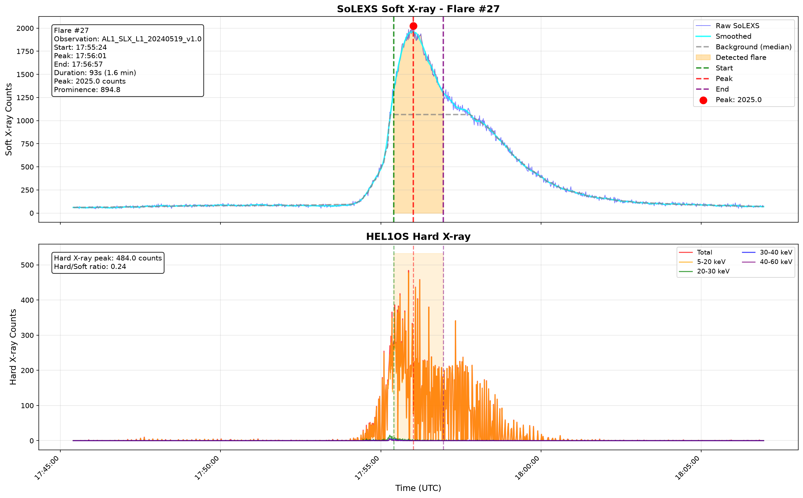
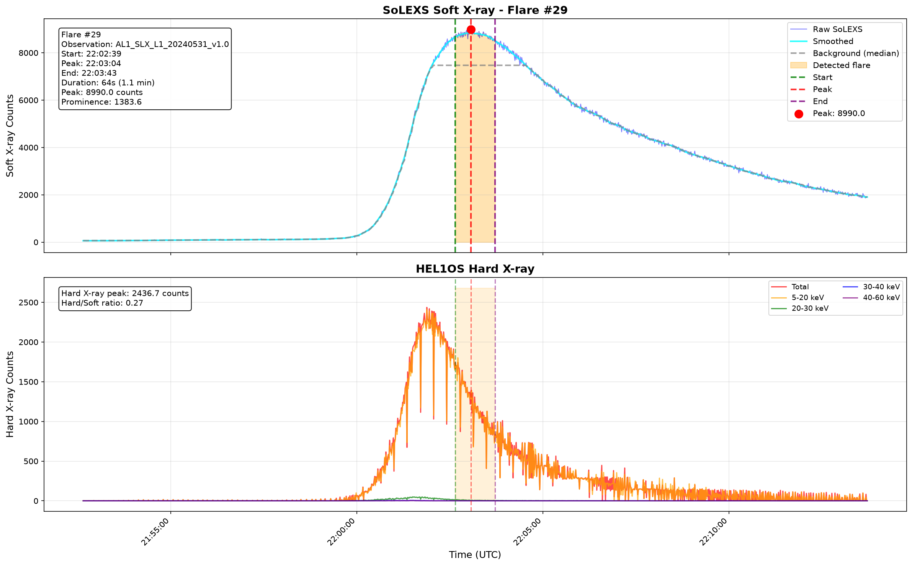

# Solar Flare Detection using Aditya-L1 SoLEXS & HEL1OS

An end-to-end pipeline for detecting solar flares from ISRO's Aditya-L1 mission using **SoLEXS** (Soft X-ray) and **HEL1OS** (Hard X-ray) Level-1 observations.

> Built as part of the **ISRO Hackathon — Challenge 15: Forecasting and/or Nowcasting of Solar Flares**.

---

## Overview

Solar flares are sudden bursts of electromagnetic radiation caused by magnetic reconnection on the Sun. Detecting these events early is critical for:

- Space weather monitoring
- Satellite operations
- Navigation systems
- Communication infrastructure

This repository implements a complete data pipeline that:

- Reads raw SoLEXS Level-1 FITS light curves
- Reads HEL1OS Level-1 observations directly from ZIP archives
- Converts both datasets into efficient Parquet format
- Synchronizes soft and hard X-ray observations
- Detects flare candidates using adaptive peak detection
- Produces flare catalogues for further analysis and forecasting

---

## Dataset

### SoLEXS

- **Instrument:** Solar Low Energy X-ray Spectrometer
- **Data type:** Soft X-ray light curves
- **Resolution:** ~1 second

### HEL1OS

- **Instrument:** High Energy L1 Orbiting X-ray Spectrometer
- **Energy bands:**
  - 5–20 keV
  - 20–30 keV
  - 30–40 keV
  - 40–60 keV
  - Total (1.8–90 keV)

Both datasets are obtained from the [ISRO ISSDC PRADAN portal](https://pradan.issdc.gov.in).

---

## Pipeline

```
Raw SoLEXS FITS         Raw HEL1OS ZIP
       │                       │
       ▼                       ▼
 SoLEXS Reader           HEL1OS Reader
       │                       │
       ▼                       ▼
 solexs.parquet          hel1os.parquet
       │                       │
       └──────────┬────────────┘
                  ▼
           Timestamp Merge
                  │
                  ▼
           merged.parquet
                  │
                  ▼
   Rolling Background Estimation
                  │
                  ▼
           Peak Detection
                  │
                  ▼
           Flare Catalogue
```

---

## Project Structure

```
solarflare-detection/
│
├── data/
│   ├── raw/
│   └── processed/
│
├── plots/
│
├── src/
│   ├── readers/
│   │   ├── solexs_reader.py
│   │   └── hel1os_reader.py
│   │
│   ├── preprocess/
│   │   └── merge.py
│   │
│   ├── detection/
│   │   └── peak_detector.py
│   │
│   └── visualization/
│       └── plot_day.py
│
└── README.md
```

---

## Features

- Reads compressed FITS observations directly from ZIP archives
- Supports hundreds of observation files
- Memory-efficient Parquet conversion
- Timestamp synchronization between instruments
- Rolling median background estimation
- Adaptive peak detection
- Automatic flare event extraction
- Daily visualization of soft and hard X-ray light curves

---

## Installation

**1. Clone the repository**

```bash
git clone https://github.com/<username>/solarflare-detection.git
cd solarflare-detection
```

**2. Create a virtual environment**

```bash
python -m venv .venv
source .venv/bin/activate
```

**3. Install dependencies**

```bash
pip install pandas numpy scipy astropy matplotlib tqdm pyarrow
```

---

## Usage

### 1. Convert SoLEXS observations

```bash
python src/readers/solexs_reader.py
```

Generates `data/processed/solexs.parquet`

### 2. Convert HEL1OS observations

```bash
python src/readers/hel1os_reader.py
```

Generates `data/processed/hel1os.parquet`

### 3. Merge datasets

```bash
python src/preprocess/merge.py
```

Generates `data/processed/merged.parquet`

### 4. Detect flares

```bash
python src/detection/peak_detector.py
```

Outputs:

- `flare_catalog.parquet`
- `peak_indices.parquet`
- `smoothed_data.parquet`

### 5. Visualize a day

```python
plot_day("2024-05-14")
```

---

## Sample Detections

### Flare #27



> **Observation:** AL1_SLX_L1_20240519_v1.0 | **Start:** 17:55:24 UTC | **Peak:** 17:56:01 UTC | **End:** 17:56:57 UTC  
> **Duration:** 93s (1.6 min) | **Peak counts:** 2025.0 | **Prominence:** 894.8 | **Hard/Soft ratio:** 0.24

---

### Flare #29



> **Observation:** AL1_SLX_L1_20240531_v1.0 | **Start:** 22:02:39 UTC | **Peak:** 22:03:04 UTC | **End:** 22:03:43 UTC  
> **Duration:** 64s (1.1 min) | **Peak counts:** 8990.0 | **Prominence:** 1383.6 | **Hard/Soft ratio:** 0.27

---

## Current Results

The current implementation successfully:

- Parses SoLEXS Level-1 observations
- Parses HEL1OS Level-1 observations
- Merges synchronized X-ray streams
- Detects flare candidates using adaptive thresholding
- Produces a structured flare catalogue
- Visualizes detected flare events

---

## Future Work

- GOES flare class estimation
- ML-based flare forecasting (LSTM / Transformer sequence models)
- Real-time detection pipeline
- Interactive dashboard
- Automatic alert generation
- Multi-instrument feature engineering

---

## Technologies

| Library | Purpose |
|---------|---------|
| Python | Core language |
| Pandas | Data manipulation |
| NumPy | Numerical computing |
| SciPy | Signal processing & peak detection |
| Astropy | FITS file handling |
| Matplotlib | Visualization |
| PyArrow | Parquet I/O |
| tqdm | Progress bars |

---

## License

This project is intended for educational, research, and hackathon purposes.

---

## Acknowledgements

- [Indian Space Research Organisation (ISRO)](https://www.isro.gov.in)
- [Aditya-L1 Mission](https://www.isro.gov.in/Aditya_L1.html)
- [ISSDC PRADAN Portal](https://pradan.issdc.gov.in)
